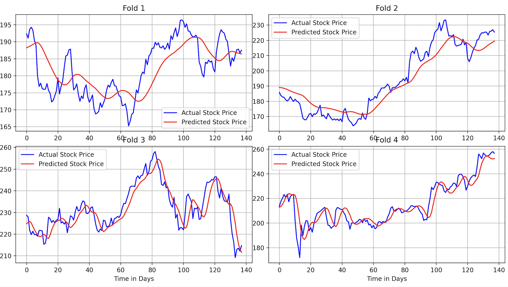

## Project Overview

The goal of this project is to build and evaluate an LSTM model for time-series forecasting, specifically for stock prices. It includes scripts to download historical data and to train, evaluate, and visualize the model's predictions.



## Features

- **Data Downloader:** A script to fetch historical stock data using the `yfinance` library.
- **LSTM Model:** A Keras-based sequential LSTM model for time-series prediction.
- **Time-Series Cross-Validation:** Uses `TimeSeriesSplit` from scikit-learn for a more robust evaluation of the model's performance on time-series data.
- **Visualization:** Generates plots for training/validation loss and actual vs. predicted stock prices for each validation fold.
- **Performance Metrics:** Calculates Mean Squared Error (MSE), Root Mean Squared Error (RMSE), Mean Absolute Error (MAE), and R-squared (R2) score.

## Getting Started

Follow these instructions to get a copy of the project up and running on your local machine.

### Prerequisites

You need to have Python 3.8+ installed on your system.

### Installation

1. **Clone the repository:**
    
    ```python
    git clone https://github.com/your-username/LSTM_Stock_Price_Prediction_DAYS.git
    cd LSTM_Stock_Price_Prediction_DAYS
    
    ```
    
2. **Create a virtual environment (recommended):**
    
    ```python
    python -m venv venv
    source venv/bin/activate  # On Windows, use `venv\Scripts\activate`
    
    ```
    
3. **Install the required packages:**
A `requirements.txt` file is provided for easy installation.
    
    ```python
    pip install -r requirements.txt
    
    ```
    
    The `requirements.txt` file should contain:
    
    ```python
    pandas
    matplotlib
    numpy
    tensorflow
    scikit-learn
    yfinance
    
    ```
    

## Usage

1. **Download the Data:**
Before running the main prediction script, you must first download the historical stock data.
    
    ```python
    python LSTM_Stock_Price_Prediction_DAYS/setup_packages/Historical_Data_Downloader.py
    
    ```
    
    This will download CSV files for the specified tickers (`AAPL`, `PG`, `JNJ`, `JPM`) into the `setup_packages` folder.
    
2. **Run the Prediction Model:**
Once the data is downloaded, you can run the main script to train the model and generate predictions.
    
    ```python
    python Stock_Market_Prediction.py
    
    ```
    
    The script will train the model on the `AAPL` dataset and display the evaluation metrics and plots.
    

## Methodology

### Data Preparation

1. **Loading Data:** The script loads the downloaded CSV file for a specific stock (e.g., AAPL).
2. **Feature Selection:** Only the 'Close' price is used for this model.
3. **Scaling:** The data is normalized using `MinMaxScaler` to a range of (0, 1), which helps the LSTM model converge faster.
4. **Sequence Creation:** The data is converted into sequences of 60 days of historical data (X) and the price on the next day (y).

### Model Architecture

The model is a `Sequential` model from Keras with the following layers:

- `LSTM(units=50, return_sequences=True)`: First LSTM layer.
- `Dropout(0.2)`: Prevents overfitting.
- `LSTM(units=50)`: Second LSTM layer.
- `Dropout(0.2)`: Prevents overfitting.
- `Dense(units=1)`: The output layer that predicts the single 'Close' price value.

### Training and Evaluation

- **Optimizer:** Adam
- **Loss Function:** Mean Squared Error
- **Cross-Validation:** The dataset is split into 4 folds using `TimeSeriesSplit` to train and validate the model on different time periods. This ensures the model is not just memorizing the data but learning underlying patterns.
- **Early Stopping:** Training is stopped early if the validation loss does not improve for 10 consecutive epochs, restoring the best model weights.

## Results

After running the script, the following outputs will be generated:

1. **Console Output:** The terminal will display the MSE, RMSE, MAE, and R2 scores for each of the 4 cross-validation folds, followed by the mean of these scores.
    
    ```python
    ---------- Cross-Validation Summary ----------
    Mean MSE: ...
    Mean RMSE: ...
    Mean MAE: ...
    Mean R2: ...
    
    ```
    
2. **Plots:** Two windows will appear showing the following plots:
    - **Model Training & Validation Loss:** A 2x2 grid of plots showing the training and validation loss curves over epochs for each fold.
    - **Stock Price Prediction:** A 2x2 grid of plots comparing the actual stock prices with the prices predicted by the model on the validation set for each fold.
